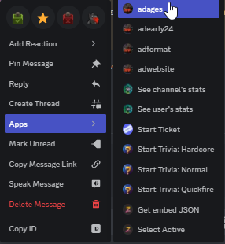

<h1 align="center">Search Commands</h1>
The search commands are used to warn users when they make a mistake in the search channels, the commands remove the post,
send a message to the user, and increase the warning counter in the database.

Almost all commands follow the following syntax: `/ad (command) (message link)`

All these commands require the user to be a moderator.
#### ages
The most used command by the staff team, when the user fails to include the ages of the characters, this command it used. 

The warning the user receives:

```
Hello, I'm a staff member of **Roleplay Meets Reborn**. The advert you have posted in #channel has failed to mention the ages of the characters you intend to use in your roleplay, as required by our sixth search rule. This includes both the characters you intend to write and the characters you want your writing partner to write. Due to this, your advert has been removed. __**Please include the ages of all characters or a general disclaimer**__, such as: "all characters are 18+", in the future. Characters under the age of 18 are not allowed to be advertised within our server.

The ages must be displayed on the advertisement on discord.

If you have any more questions, our staff team is always available to help you.
<#977720278396305418>
```

#### format
This command is used when users fail to follow the formatting guidelines, which happens rather often. The formatting guidelines
are enforced to keep the channels readable and the automoderator is helping staff keep track of these guidelines.

The warning the user receives:

```
Hello, I am a staff member of Roleplay Meets: Reborn. I am reaching out to you regarding your ad in {}. It has been removed due to **improper formatting.** Please review our Search Rules, specifically S8: Excessive Adverts and repost your ad with the appropriate fixes. 

Reasons your advert may have been removed include:
- Spacing between each list item
- Double spaces between paragraphs and/or sentences
- Having more than 10 items **total** in your lists. Lists **are** counted cumulatively or having an excessively long list
- Using a font that is not Discord's default font

If your advert has excessive lists, we do recommend using forums in order to share your lists, be they fandoms, potential pairings, genres, or other items you may want to list. If you have any questions regarding adverts or the rules, please do not hesitate to open up a ticket through <#977720278396305418>. Thank you for your cooperation!
```

#### adearly24 / adearly72
When an user posts too early, this command sends a message to the user to warn them about this. The 24h version is used 
for quick-search, the adearly72 is used for everything else.

Plans are for these commands to eventually be retired for the main channels, and only used for forums.

The warning the user receives:

```
Hello, I am a staff member of **Roleplay Meets: Reborn** . The advert you have posted within our #channel has been posted too early, please wait 1 day(24 hours)/3 days(72 hours) between each posts.

Repeatedly posting too early may lead to a search ban which means you can not post an advert for a certain time.

If you have any questions regarding adverts or the rules, don't hesitate to ask in <#977720278396305418>. 
Thank you for your cooperation!
```

#### template
The template command is used when an user does not follow the template set in the channel, most often used for pairing search and 
roleplay profile. 

The warning the user receives:

```
Hello, I am a staff member of **Roleplay Meets: Reborn** . The advert you have posted within our #channel does not match the template within the channel, the template can be found in the **channel pins**. 

Please be sure to provide all information that the template requests, as failure to abide by the template will result in your post being deleted!

If you have any questions regarding adverts or the rules, don't hesitate to ask in <#977720278396305418>. 
Thank you for your cooperation!
```
#### Custom
Custom is used when none of the other commands are suitable to inform users of their errors, as the warning is written by the staff member

syntax: `/ad custom (message_link) (warning)`

#### duplicate
When a user posts the same advert within the repost time in multiple channels, this command is used. Unfortunately it removes 
only the first advert, however this might be fixed in the future.

The warning the user receives:

```
Hello, I am a staff member of **Roleplay Meets Reborn**, the advert you have posted in #channel is a duplicate of what you've posted in #channel and has been removed. Please don't repost the same advert in multiple channels! You can repost every 24 hours in quick search channels and every 72 hours in regular search channels or you can make changes to your advert and post it in **another** channel.

If you have any questions regarding adverts or the rules, don't hesitate to ask in <#977720278396305418>. 
Thank you for your cooperation!
```

#### pictures
When an user includes more than 5 images in the forums, this command is used to warn the user. Pictures are no longer
allowed in regular search channels.

The warning the user receives:

```
Hello, I'm a **bot** of Roleplay Meets: Reborn. I'm reaching out to you regarding your ad in #channel. It's been removed for **having more than 5 images**. Please repost it with the appropriate fixes.

    If you have any questions regarding adverts or the rules, don't hesitate to ask in <#977720278396305418>. 
    Thank you for your cooperation!
```

#### *2.3 NEW:* Website 
This command is used when an user includes a website, such as barbermonger, which is not allowed within RMR. This includes a
majority of porn websites due to dangerous adverts.

The warning the user receives:

```
Hello, I am a staff member of Roleplay Meets: Reborn. I am reaching out to you regarding your ad in {msg.channel.mention}. It has been removed due to **dangerous/inappropriate websites.**

Reasons your advert may have been removed include:
- You linked a porn website, which often carry dangerous advertisements riddled with viruses.
- You have linked to barbermonger, a website we do not allow on RMR.
- Staff has decided to not allow the link as we deem it suspicious and potentially harmful to our users.

The safety of our members is important to us and we appreciate your understanding in this matter. If you have any questions regarding adverts or the rules, please do not hesitate to open up a ticket through #ask-the-staff. Thank you for your cooperation!
```

#### *2.3 NEW:* canonuapic
Recently RMR has banned all underaged canon images, as a result this command was added. If the character in the image
is underaged in canon, it is removed and the user is warned.

The warning the user receives:

```
Hello, I'm a **bot** of Roleplay Meets: Reborn. I'm reaching out to you regarding your ad in #channel. It's been removed for **posting an NSFW picture with a canonically underaged character**. Please repost without these images.

Roleplay Meets: Reborn no longer tolerates pictures of characters that have been aged up which are NSFW. Failure to comply further with this rule comes with dire consequences.

If you have any questions regarding adverts or the rules, don't hesitate to ask in #ask-the-staff. 
Thank you for your cooperation!
```
#### *2.3 BETA: advanced*
This command is currently being tested, and recommended to be used to gather testing data! 

To execute this command: `/ad advanced (searchrule 1) [searchrule2] [searchrule3]`<br>
all current options, more will be added:
```py
        Choice(name="ages", value="age"),
        Choice(name="early72", value="e72"),
        Choice(name="early24", value="e24"),
        Choice(name="format", value="form"),
        Choice(name="template", value="temp"),
        Choice(name="duplicate", value="dup"),
        Choice(name="pictures", value="pic"),
```

The warning the user receives is based upon the option chosen, here is the code which determines that:

```py
            case "age":
                warn = "Your advert failed to include character ages. We require both ages of your characters and your partner. It is recommended to add a general disclaimer."
            case "e72":
                warn = "You have posted too early in the channel, this channel has a 72 hour cooldown."
            case "e24":
                warn = "You have posted too early in the channel, this channel has a 24 hour cooldown."
            case "form":
                warn = "Your advert's format is incorrect. Potential causes: Double spacing, spacing between list items, more than 10 list items, using a font that is not Discord's default font."
            case "temp":
                warn = "Your advert did not follow the template."
            case "dup":
                warn = "Your advert was posted in other channels, we only allow unique adverts to be posted in multiple channels."
            case "pic":
                warn = "You have too many pictures within your advert. We allow up to 5 (FORUMS ONLY)."
```

#### admin: Searchban

syntax: `/searchban (user) (time)`

This command is used by the admins when a user repeatedly breaks the rules and needs to be timed out fow a week, two weeks, a month, permanent or a custom time.

upon execution the command applies the search banned role to the user and DMs them to inform them about their search ban.

Currently this command does not track the time to unban them, and has to be done by hand.  

### Retired commands:
* adtoolong (retired in: 2.1 reason: Automod now does this)
* adtooshort (retired in: 2.1 reason: Automod now does this)


## apps

In the apps there are versions of these commands, identical to these. All you have to do is right click a post, select ads
and select the warning.

example:<br>



