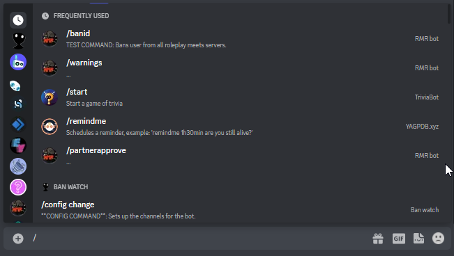
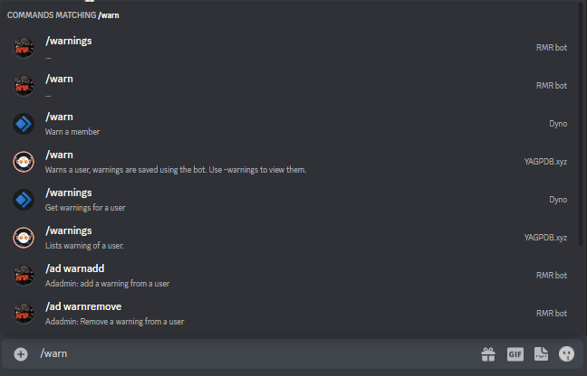
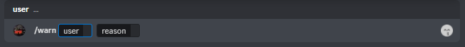
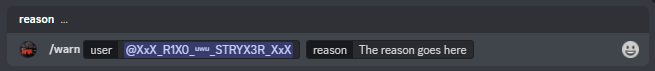
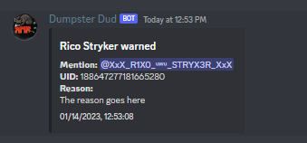

<h1 align="center">Slash guide</h1>

RMRbot 2.0 has slowly been moving towards more and more slash (/) commands as these are easier to use, as well as the 
future of discord's command structure. To ensure there is no confusion about how to use these commands here is an explanation
on how to use these commands

1. we type in the / to signal to discord, we want to execute a command, a list of commands will pop up. 

2. You can type in more to narrow down results, for this example we will be executing /warn, so we type out some of the word and then select it in the list. 

3. Now you select the command out of the list, and it will give you the requirements to execute this command. 

4. Let's say we want to warn rico, we'd input the following 

5. Now you press enter to send the command, this will be the end result:  

6. Congratulations, you've successfully executed your first slash command!